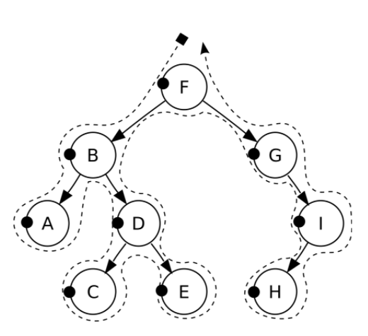
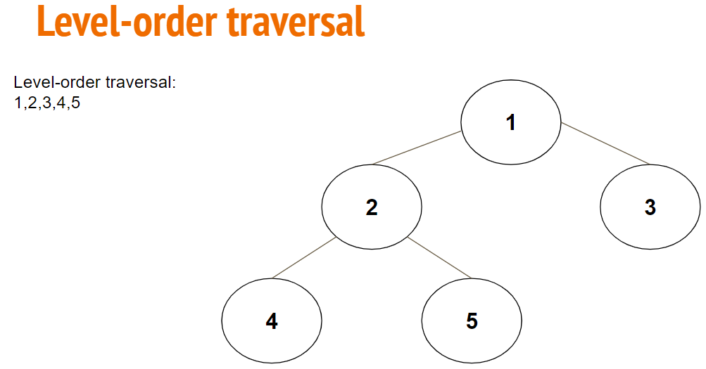
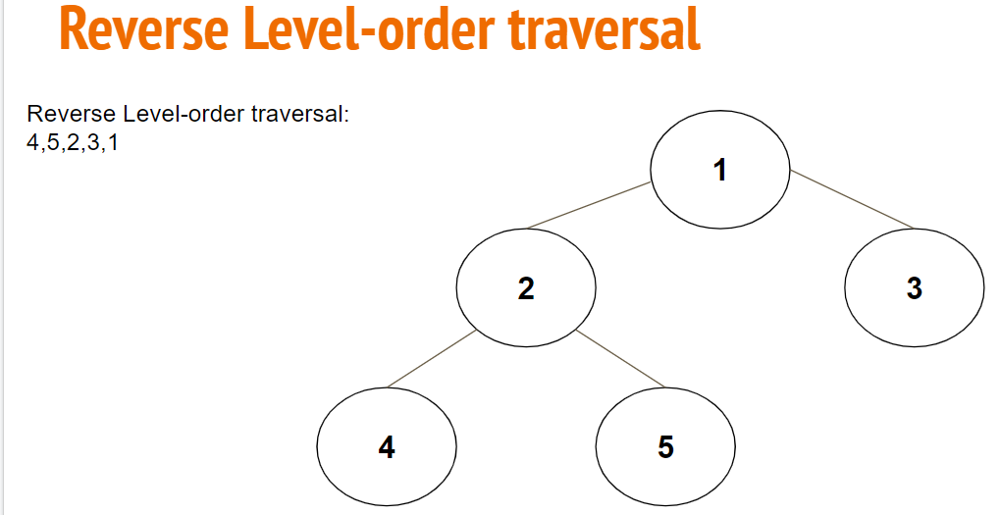
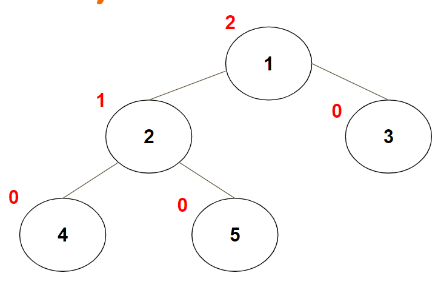

# Trees

A tree has the following properties:

* One node of the tree is designated as the root node
* Every node n, except the root node, is connected by an edge from exactly one other node p, where p is the parent of n
* A unique path traverses from the root to each node
* If each node in the tree has a maximum of two children, we say that the tree is a binary tree

## Tree traversal

Process of visiting (checking and/or updating) each node in a tree data structure, exactly once.

There are three common ways to traverse in **depth-first order**: 

* Pre-order:

We visit the root node first, then recursively do a preorder traversal of the left subtree, followed by a recursive preorder traversal of the right subtree.

Practical example: Suppose that you wanted to read this book from front to back. The preorder traversal gives you exactly that ordering. Starting at the root of the tree (the Book node), B is chapter 1 and G is chapter 2

Solution: F, B, A, D, C, E, G, I, H

* In-order:

We recursively do an inorder traversal on the left subtree, visit the root node, and finally do a recursive inorder traversal of the right subtree.

Solution: A, B, C, D, E, F, G, H, I

* Post-order:

We recursively do a postorder traversal of the left subtree and the right subtree followed by a visit to the root node.

Solution: A, C, E, D, B, H, I, G, F 

Breadth First Search:

* Level- Order Traversal

* Reverse Level Order Traversal

### Tree Methods

* Height - The height of a tree is equal to the maximum level of any node in the tree.

* Size - The total number of nodes in the tree
* Diameter - Is the maximum distance between any two nodes

## Binary Search Tree

Differ from binary trees in that the entries are ordered by a property 

### BST Property

**Every node** on the right subtree has to be larger than the current node and every node on the left subtree has to be smaller than the current node.

## Usefull links

https://github.com/vprusso/youtube_tutorials/tree/master/data_structures/trees/binary_trees

https://runestone.academy/runestone/books/published/pythonds/Trees/Objectives.html
